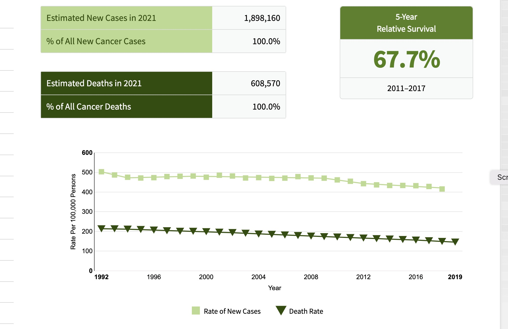
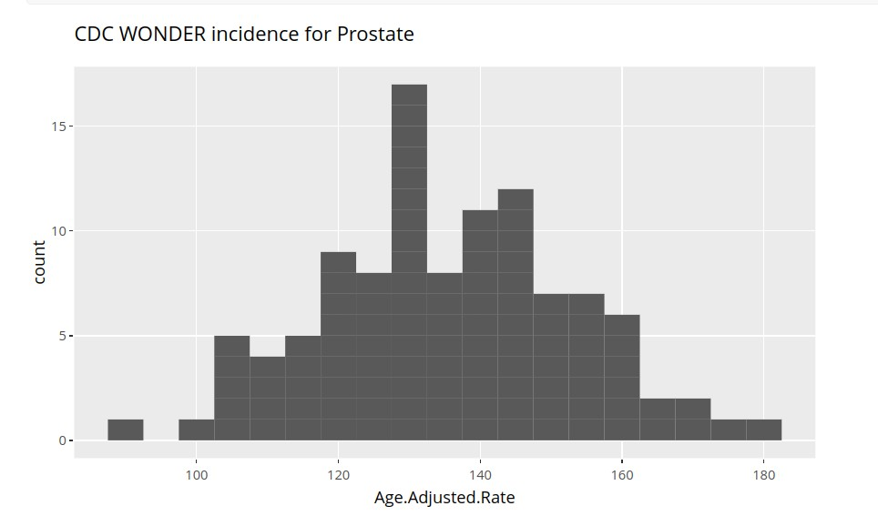
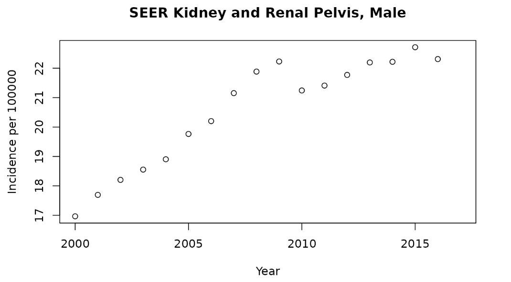

# A0 Introductory Notebook

## Introductory Notebook

Here are some questions that explore your prior understanding of cancer
and cancer data. The main purpose of this notebook is to show you how to
launch a notebook and submit answers.

### Public Resources

The National Cancer Institute (NCI) is a branch of the National
Institutes of Health. Visit [NCI’s
website](https://www.cancer.gov/about-nci/overview) to learn more about
NCI’s mission, then answer the questions below to the best of your
ability.

#### Exercises

A.0.1 Mark T (for True) or F (for False) next to each statement

A.0.1.1 \_\_ NCI is funded by federal tax dollars

A.0.1.2 \_\_ NCI sets the prices for cancer treatments in the US

A.0.1.3 \_\_ NCI leads efforts in the US to improve cancer treatment and
survivorship

A.0.1.4 \_\_ Cancer researchers can apply to NCI to receive money to
investigate questions about cancer biology

A.0.1.5 \_\_ Some cancers and their outcomes are not actively researched
because of limited resources available to NCI

### Terminology

Understanding the language used in a particular field is important for
clear and effective communication. Throughout the course you will see a
multitude of statistical and medical terms.

#### Question

Mark T (for True) or F (for False) next to each statement

A.0.2 \_\_ The incidence of breast cancer in a population – for example,
the people of the state of Rhode Island – refers to the number of people
currently undergoing treatment for breast cancer in that population.

### Understanding Rates

This display is from the Surveillance, Epidemiology and End Results
(SEER) program run by NCI.

SEER overview, 2021

#### Question

A.0.3 According to this diagram, in a random collection of 100000
americans in 2018, how many people will die of colon or rectum cancer?

#### Answer

A.0.3

### Visualizing data

A histogram is a data visualization that shows the relative frequencies
of measured quantities. Below we have a histogram of rates of prostate
cancer incidence across a collection of American cities, reported as
age-adjusted rates per 100000 males.

Cancer prostate Incidence

#### Questions

A.0.4 What is approximately the highest rate per 100000 men of prostate
cancer incidence reported in the cities surveyed?

A.0.5 What is approximately the number of cities reporting rates lower
than 120 per 100000 men?

#### Answers

A.0.4

A.0.5

### Interpreting data

This figure shows changes in the rate of new kidney cancers compiled by
the NCI Surveillance, Epidemiology and End Results program.

Kidney Cancer Rates

#### Question

A.0.6 Which of the following could be a likely explanation for the
change in rate reports between 2009 and 2010, and why?

1.  Improved health

2.  data error

3.  change in diagnostic procedure and/or definition of kidney/pelvic
    cancer incidence

#### Answer

A.0.6

