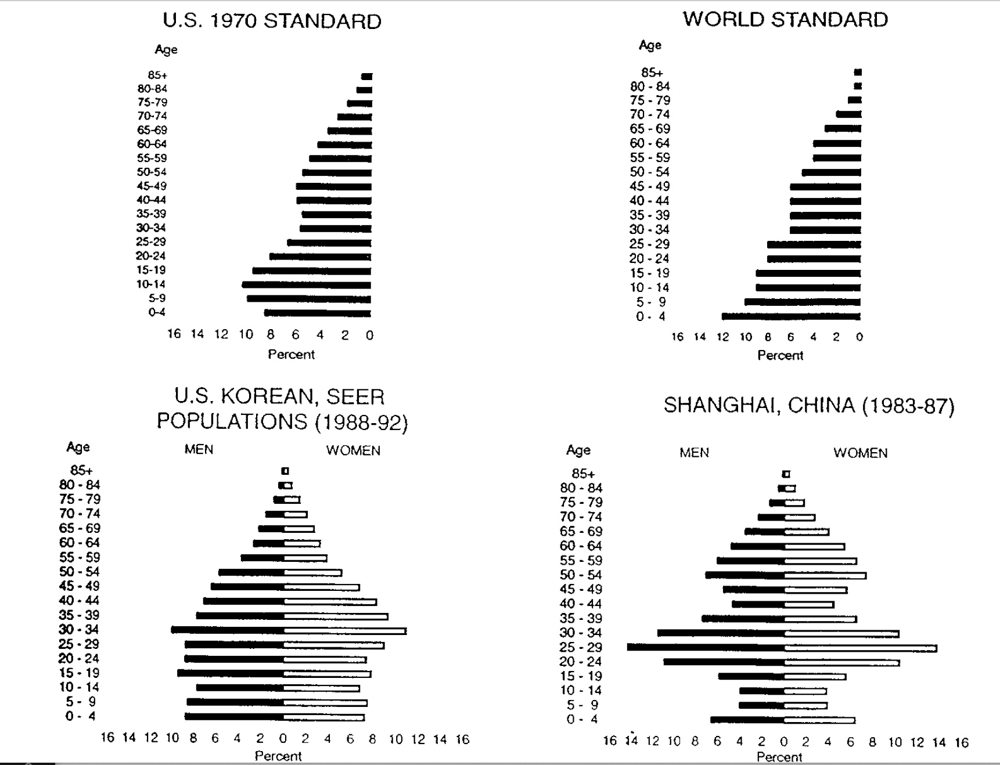

<div id="main" class="col-md-9" role="main">

# A6 Age standardization of cancer rates

    ## Warning: multiple methods tables found for 'scale'

    ## Warning: replacing previous import 'BiocGenerics::scale' by
    ## 'DelayedArray::scale' when loading 'SummarizedExperiment'

<div class="section level2">

## Age adjustment for fair comparisons

Two basic types of comparison are of interest in cancer epidemiology:

-   Do cancer rates differ between geographic regions (counties, states,
    countries, …)?
-   Do cancer rates change over time?

Because cancer risks increaase generally as people age, comparisons of
cancer risk should account for the “age structure” in the regions or
time periods being compared.

</div>

<div class="section level2">

## Crude rate examples

Crude rates ignore age structure. Here are some examples of mortality
rates taken (with rounding) from a Statistics Canada web site.

<div id="cb3" class="sourceCode">

``` r
canada_crude[6,4] = NA
canada_crude
```

</div>

    ##          agegrp         characteristic     2000     2011
    ## 1      0 to 39y estimate of population 17000000 17200000
    ## 2                      # cancer deaths     1340     1000
    ## 3                           crude rate        7        5
    ## 4 40y and older estimate of population 13600000 17150000
    ## 5                      # cancer deaths    61300    71400
    ## 6                           crude rate      450       NA
    ## 7      All ages estimate of population 30600000 34400000
    ## 8                      # cancer deaths    62640    72400
    ## 9                           crude rate      204      210

Question: What is the (rounded) crude mortality rate for the older age
group in 2011?

</div>

<div class="section level2">

## Age structure

The “age structure” of a population is the percentage of population
reporting ages in different groups. Usually the grouping is finer than
what we are using in this example; more realistic illustrations are
given below.

Statistics Canada proposed using the age structure of Canada in 1991 as
a reference for standardization. In 1991, 62% of Canadians were age 0 to
39y, and 38% were 40y and older.

We use these percentages to adjust the crude rates.

</div>

<div class="section level2">

## Adjusted rate computation

For the year 2000, we take the crude rates of 7 and 450 (per 100000
population) and reweight and sum:

    7 * .62 + 450 * .38

yielding 175.3 per 100000 “standard population”. This is the age
standardized mortality rate in the year 2000.

<div class="section level3">

### Questions

A.6.1 What is the age standardized mortality rate for 2011?

A.6.2 What can you say about the cancer mortality trend in Canada
between 2000 and 2011?

</div>

<div class="section level3">

### Answers

    A.6.1

    A.6.2

</div>

</div>

<div class="section level2">

## Some examples of age structure models

A [methods
paper](https://wonder.cdc.gov/wonder/help/cancer/fayfeuerconfidenceintervals.pdf)
on confidence intervals for standardized rates includes the following
display:

<div class="figure">



Age structure

</div>

We read this as showing that in the US in 1970, about 18% of the
population was under 10 years of age, while in the world overall, about
22% of the population was under 10 years of age.

<div class="section level3">

### Question

A.6.3 What features of the bottom two displays above suggest that it
will be important to differentiate age distributions for men and women
in forming standardized rates?

</div>

<div class="section level3">

### Answer

    A.6.3

</div>

</div>

</div>
