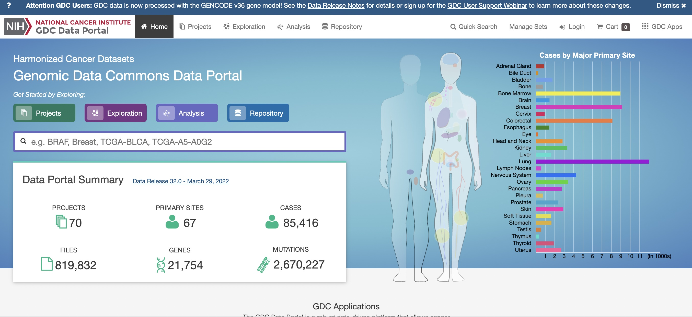
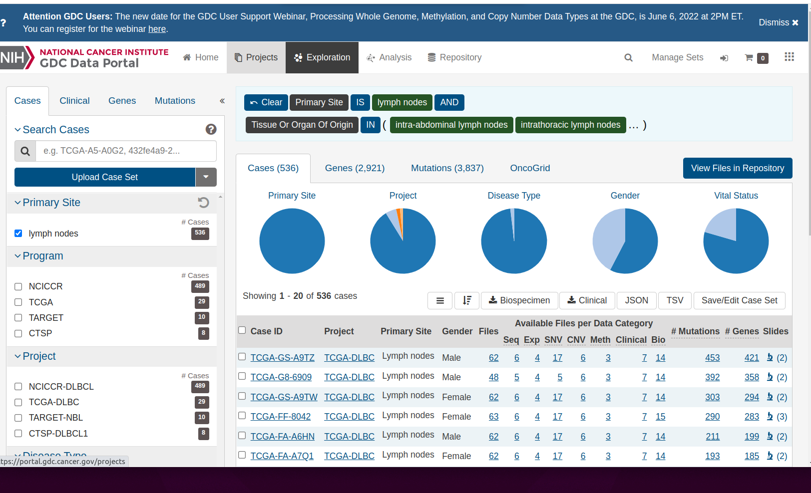
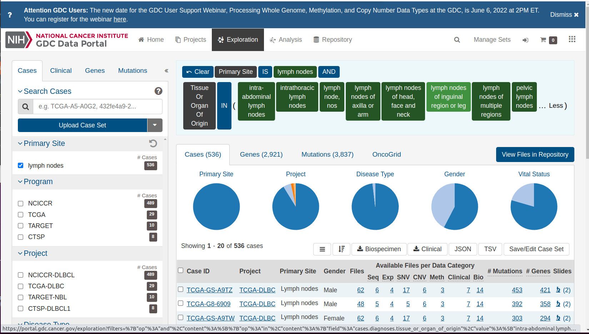
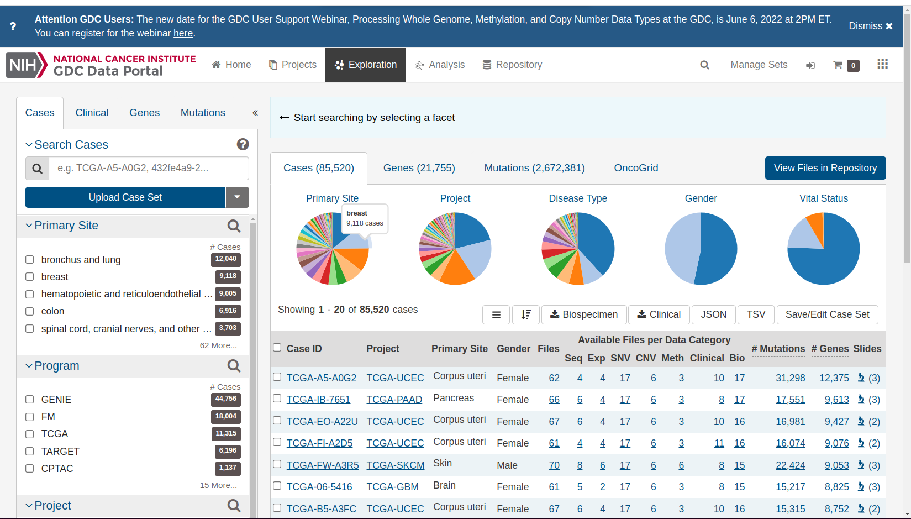
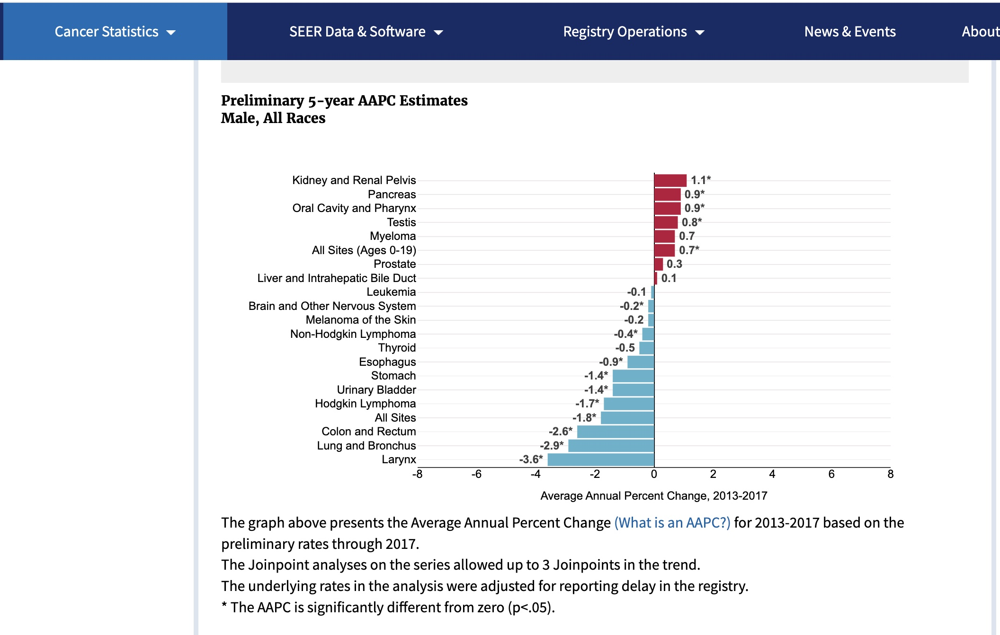
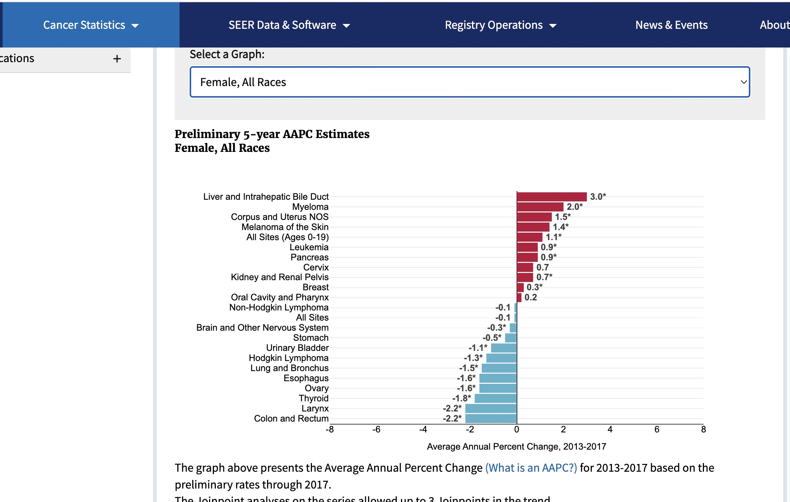
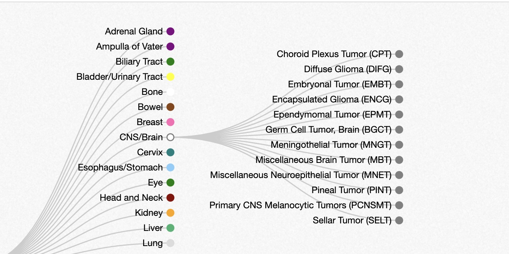

<div id="main" class="col-md-9" role="main">

# C1 Cancer in our bodies: Overall view

<div class="section level2">

## Cancers originate in specific organs

<div class="figure">



Overall, data commons

</div>

This display can be found at the NCI [Genomic Data
Commons](https://portal.gdc.cancer.gov/).

<div class="section level3">

### Resources for basic research

The Data Commons centralizes cancer data resources from a variety of
large-scale basic research projects. It is not used to record
population-level information about ongoing cancer risks.

Click on the right shoulder of the female form to find

<div class="figure">



Lymphatic cancers

</div>

Notice the description of the logic of selecting the ‘shoulder’, which
contains an icon depicting lymph nodes. There are tiles expressing the
logic of selecting information on lymph nodes from the data commons.
“Primary Site” IS “lymph nodes” AND “Tissue or Organ Of Origin” IN and
then a parenthesis begins. Click on the ellipsis to reveal the full set
of lymph-related tissues:

<div class="figure">



Details of lymphatic cancers

</div>

If we “clear” the selection, we get a complete overview of all studies
and cancer types.

<div class="figure">



Selection cleared

</div>

<div class="section level5">

##### Exercise

C.1.1 After clearing the selection, hover over the “Disease Type” pie
chart to learn the most common cancer types.

</div>

<div class="section level5">

##### Answer

    C.1.1

</div>

</div>

<div class="section level3">

### Resources on the burden of cancer in the population, by primary site

The Genomic Data Commons gives an overview of resources for basic
research in cancer. Epidemiologic research is conducted at the
population level, and includes efforts to identify all reports of cancer
diagnoses throughout the United States.

There is generally a time lag for collecting and processing data.
Estimates for 2018 and later years are still being developed.

<div class="section level4">

#### Summarizing annual changes in rates

In these displays, the focus is on changes in the population burden. The
Average Annual Percentage Change (AAPC) is a number we want to be
negative. This would indicate that the risk of this type of cancer is
diminishing over time.

SEER (Surveillance, Epidemiology and End Results) [estimates for
2017](https://seer.cancer.gov/statistics/preliminary-estimates/preliminary.html)
for males:

<div class="figure">



SEER2017 male

</div>

For females:

<div class="figure">



SEER2017 female

</div>

</div>

<div class="section level4">

#### Detailed visualization of the trends

We have a table distributed by the SEER program.

<div id="cb2" class="sourceCode">

``` r
data(SEER_2018)
datatable(SEER_2018[,2:6])
```

</div>

<div id="htmlwidget-ac96cb3ee4656e2e9ec3"
class="datatables html-widget html-fill-item"
style="width:100%;height:auto;">

</div>

This can be used to visualize trends over time.

<div id="cb3" class="sourceCode">

``` r
mkid = SEER_2018 |> dplyr::filter(CancerSite == "Kidney and Renal Pelvis" & Sex == "Male") 
fcol = SEER_2018 |> dplyr::filter(CancerSite == "Colon and Rectum" & Sex == "Female") 
with(mkid |> dplyr::filter(Race=="All Races"), plot(rate.2.2018~Year, ylab="Incidence per 100000", xlab="Year",
    main="SEER Kidney and Renal Pelvis, Male"))
```

</div>


<div id="cb4" class="sourceCode">

``` r
with(fcol |> dplyr::filter(Race=="All Races"), plot(rate.2.2018~Year, ylab="Incidence per 100000", xlab="Year",
    main="SEER Colon and Rectum, Female"))
```

</div>


The plot for Kidney and Renal Pelvis cancer for males shows a difficulty
with summarizing rates by a single number (e.g., average annual
percentage change). The rates can change in complex ways owing to

-   changes in approaches to screening
-   logistical problems of reporting
-   improvements in preventive strategies

Epidemiologists try to uncover causes of changes in rates, and produce
methods to reliably summarize them in the face of these complications.

</div>

</div>

<div class="section level3">

### Cancer subtype hierarchy

The lists of cancer sites we’ve seen thus far are fairly informal.
Cancer subtypes can be identified by various methods, with implications
for prognosis and treatment.

The oncotree resource at Memorial Sloan-Kettering presents a snapshot of
current thinking about relationships among cancer types.

Below is a small excerpt from the
[oncotree](http://oncotree.mskcc.org/#/home), showing a subset of
subtypes of brain cancer types. Many of the nodes on the right can be
expanded to reveal additional subtypes.

<div class="figure">



Oncotree snippet

</div>

</div>

</div>

</div>
