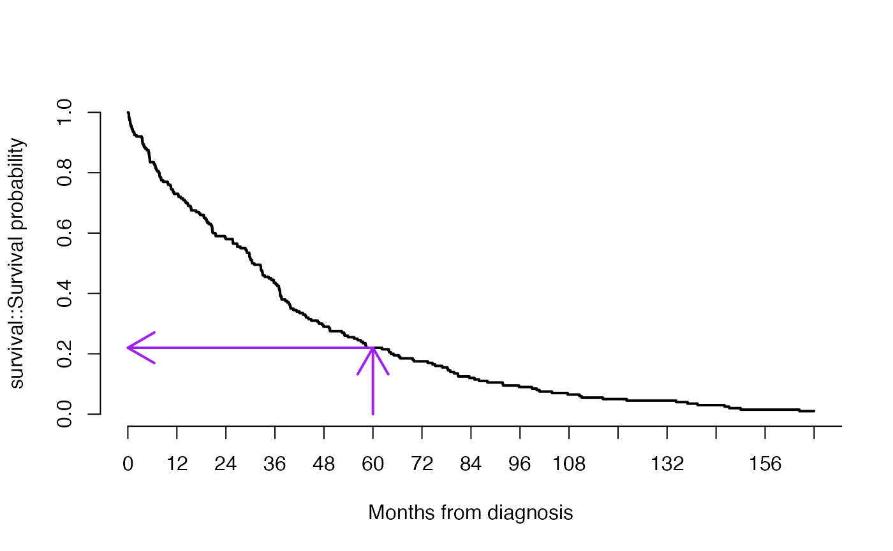

<div id="main" class="col-md-9" role="main">

# C2 Variation in survival with cancer

    ## Warning: multiple methods tables found for 'scale'

    ## Warning: replacing previous import 'BiocGenerics::scale' by
    ## 'DelayedArray::scale' when loading 'SummarizedExperiment'

<div class="section level2">

## The survival curve for a cohort of individuals

For a variety of factors that are mostly demanding of further research,
individuals with a given type of cancer may exhibit longer or shorter
times from diagnosis to death.

<div class="section level3">

### Basic definition

When times from diagnosis to death have been recorded on individuals in
a cohort, a survival curve is a plot with values (x, y) where x is time
elapsed from diagnosis, and y is the proportion of individuals surviving
at least x units of time.

<div id="cb3" class="sourceCode">

``` r
build_simple_survival_curve()
```

</div>


Note that at 0 months, the probability of surviving is 100%. The
probability of surviving at least 12 years (144 months) in this cohort
is very small.

</div>

<div class="section level3">

### Reading off the median survival time

The median of a set of numbers is the “middle” number *m*, with as many
values smaller than *m* as there are values larger than *m*. Thus the
median of the numbers 1, 2, 3, 4, 5 is 3. If there is an even number of
values, we average the two middle numbers (e.g., for 1, 2, 3, 4, 5, 6,
we would use 3.5 as the median.)

The following display shows how to read the median survival time from a
survival curve: draw the horizontal line at *y* = 1/2 and determine the
*x* value where the intersection occurs.

<div id="cb4" class="sourceCode">

``` r
show_median_estimate()
```

</div>


</div>

<div class="section level3">

### Reading off the five-year survival probability

<div id="cb5" class="sourceCode">

``` r
show_5y_estimate()
```

</div>



</div>

<div class="section level3">

### Exercises

For a different cohort of patients, the survival curve is depicted
below:

<div id="cb6" class="sourceCode">

``` r
do_new_surv()
```

</div>


C.2.1 True or false: For this cohort, almost all individuals live at
least 1.5 years after diagnosis

C.2.2 Estimate the median survival time in months.

C.2.3 What is the one-year survival probability? What is the ten-year
survival probability?

</div>

<div class="section level3">

### Answers

    C.2.1

    C.2.2

    C.2.3

</div>

</div>

</div>
