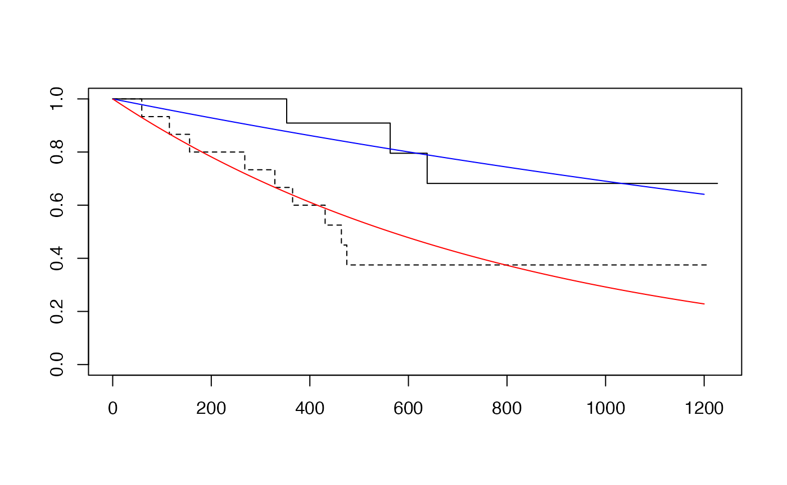

<div id="main" class="col-md-9" role="main">

# D4 Methods of comparing treatments

    ## Warning: multiple methods tables found for 'scale'

    ## Warning: replacing previous import 'BiocGenerics::scale' by
    ## 'DelayedArray::scale' when loading 'SummarizedExperiment'

<div class="section level2">

## Comparing cancer treatments

In section C2 we learned how to interpret survival curves, which
indicate the probability of surviving beyond a given period of time from
diagnosis of disease.

In this section we will examine data from a study published in 1979,
that is conveniently available with R’s `survival` package.

The citation for the study is

    J H Edmonson, T R Fleming, D G Decker, G D Malkasian, E O Jorgensen, J A Jefferies, 
    M J Webb, L K Kvols, Cancer Treat Rep . 1979 Feb;63(2):241-7.
    Different chemotherapeutic sensitivities and host factors affecting prognosis in 
    advanced ovarian carcinoma versus minimal residual disease

The abstract is provided at the end of this vignette.

The data for the ovarian cancer study has the following form:

<div id="cb4" class="sourceCode">

``` r
library(survival)
datatable(ovarian)
```

</div>

<div id="htmlwidget-ac96cb3ee4656e2e9ec3"
class="datatables html-widget html-fill-item"
style="width:100%;height:auto;">

</div>

The variable description is

    Format:

           futime:    survival or censoring time                           
           fustat:    censoring status                                     
           age:       in years                                             
           resid.ds:  residual disease present (1=no,2=yes)                
           rx:        treatment group                                      
           ecog.ps:   ECOG performance status (1 is better, see reference) 

We will consider three aspects of interpretation of these data.

<div class="section level3">

### Estimation of survival probabilities by treatment group

<div id="cb6" class="sourceCode">

``` r
osurv = Surv(ovarian$futime, ovarian$fustat)
ofit1 = survfit(osurv~ovarian$rx)
plot(ofit1, lty=1:2)
legend(0, .4, lty=1:2, legend=c("cyc 1g/m2", "cyc .5g/m2 + adria"))
```

</div>


</div>

<div class="section level3">

### Testing for treatment effect

<div id="cb7" class="sourceCode">

``` r
survdiff(osurv~ovarian$rx)
```

</div>

    ## Call:
    ## survdiff(formula = osurv ~ ovarian$rx)
    ## 
    ##               N Observed Expected (O-E)^2/E (O-E)^2/V
    ## ovarian$rx=1 13        7     5.23     0.596      1.06
    ## ovarian$rx=2 13        5     6.77     0.461      1.06
    ## 
    ##  Chisq= 1.1  on 1 degrees of freedom, p= 0.3

</div>

<div class="section level3">

### Modeling the survival curves for the effect of residual disease

We can produce a very compact, two parameter model for the survival
distributions for patients with and without residual disease.

<div id="cb9" class="sourceCode">

``` r
summary(survreg(osurv~I(ovarian$resid.ds-1), 
   dist="exponential"))
```

</div>

    ## 
    ## Call:
    ## survreg(formula = osurv ~ I(ovarian$resid.ds - 1), dist = "exponential")
    ##                          Value Std. Error     z      p
    ## (Intercept)              7.919      0.577 13.72 <2e-16
    ## I(ovarian$resid.ds - 1) -1.214      0.667 -1.82  0.069
    ## 
    ## Scale fixed at 1 
    ## 
    ## Exponential distribution
    ## Loglik(model)= -96.1   Loglik(intercept only)= -98
    ##  Chisq= 3.87 on 1 degrees of freedom, p= 0.049 
    ## Number of Newton-Raphson Iterations: 4 
    ## n= 26

<div id="cb11" class="sourceCode">

``` r
ofit2 = survfit(osurv~ovarian$resid.ds)
plot(ofit2, lty=1:2)
tim = 1:1200
pp_nores = 1-pexp(1:1200, 1/exp(7.9)) # round parameter value
lines(tim, pp_nores, col="blue")
pp_res = 1-pexp(1:1200, 1/exp(7.9-1.2))
lines(tim, pp_res, col="red")
```

</div>



</div>

<div class="section level3">

### Exercises

D.4.1 Interpret confidence intervals for the one-year survival
probabilities for the two treatments, ignoring the presence or absence
of residual disease.

<div id="cb12" class="sourceCode">

``` r
par(mfrow=c(1,2))
with(ovarian[ovarian$rx==1,], plot(survfit(Surv(futime,fustat)~1),conf.int=TRUE))
with(ovarian[ovarian$rx==2,], plot(survfit(Surv(futime,fustat)~1),conf.int=TRUE))
```

</div>


</div>

<div class="section level3">

### Answers

    D.4.1 

Abstract of 1979 paper:

    Treatment of patients with advanced ovarian carcinoma (stages IIIB and IV) using 
    either cyclophosphamide alone (1 g/m2) or cyclophosphamide (500 mg/m2) plus 
    adriamycin (40 mg/m2) by iv injection every 3 weeks each produced partial 
    regression in approximately one third of the patients. Survival curves and 
    time-to-progression curves for the two regimens were nearly identical 
    in these patients with advanced disease. These same regimens produced different 
    results when used monthly in patients who had minimal residual 
    disease (stages II and IIIA). In patients with minimal residual disease 
    the therapeutic index of the combination regimen was superior to that of 
    cyclophosphamide alone. Prognosis was better overall among patients with 
    minimal residual disease than among patients with advanced disease. Within 
    the minimal-disease group grossly complete excision of tumor prior to 
    chemotherapy was associated with still better prognosis. Among patients 
    with advanced disease, prognosis was significantly better for older patients 
    despite their generally less favorable performance scores. Much 
    of this prognostic superiority appeared to be related to menopausal 
    status and presumably to the depletion of endogenous estrogens in the older patients.

</div>

</div>

</div>
