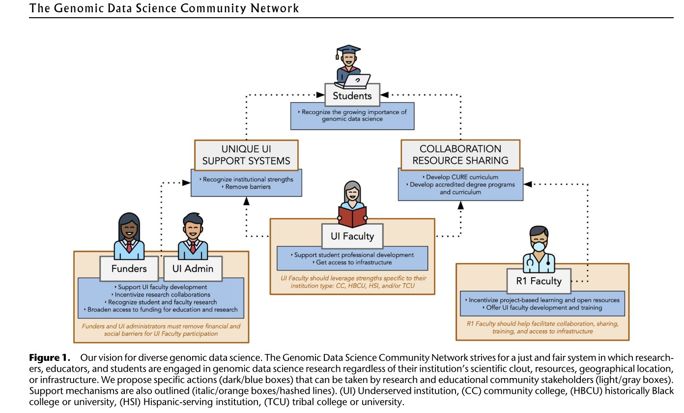
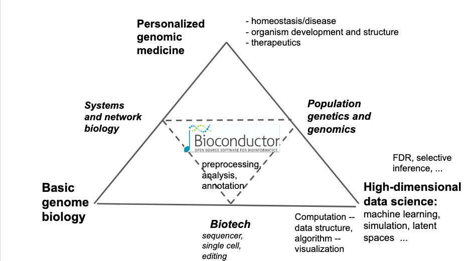
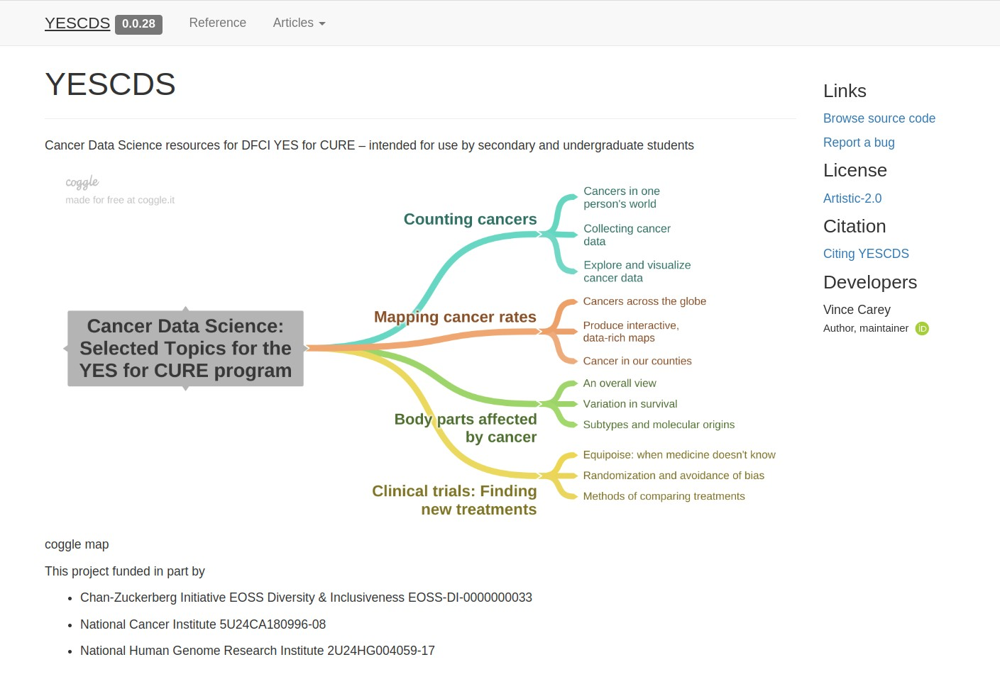
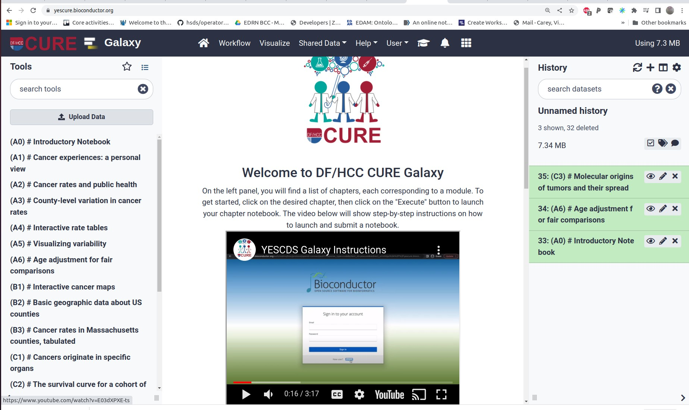

# E1 Inclusive genomic data science education, illustrated with cancer genomics

    ## Warning: multiple methods tables found for 'scale'

    ## Warning: replacing previous import 'BiocGenerics::scale' by
    ## 'DelayedArray::scale' when loading 'SummarizedExperiment'

## Introduction: Grow the genomics data science workforce

GDSCN schema

## Bioconductor as a vehicle

Bioc triangle

## R packages and r markdown as instructional assets

facepage

## Galaxy deployed in NSF Jetstream2 as the presentation/experience platform

yescure

