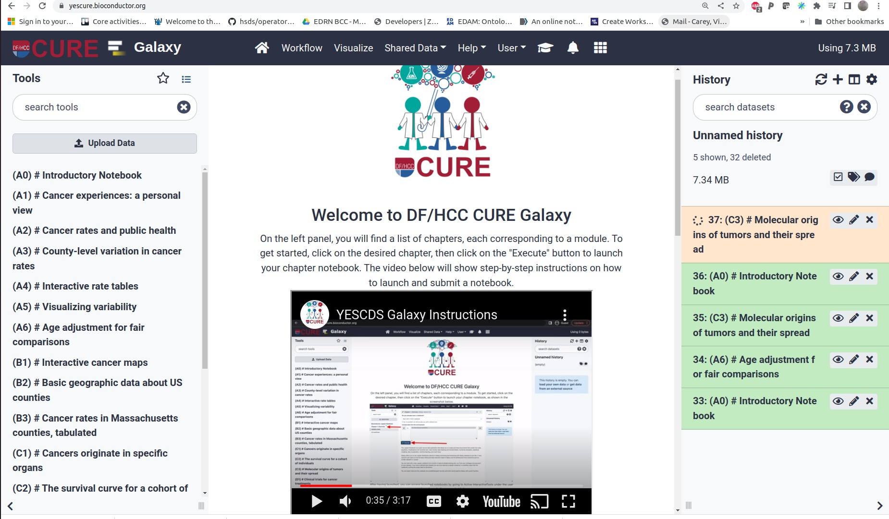

```{r setup, include=FALSE}
library(tufte)
# invalidate cache when the tufte version changes
knitr::opts_chunk$set(tidy = FALSE, cache.extra = packageVersion('tufte'))
options(htmltools.dir.version = FALSE)
suppressPackageStartupMessages({
library(BiocStyle)
library(YESCDS)
library(ggplot2)
})
```

# Introduction

The [YES for CURE](https://www.dfhcc.harvard.edu/research/cancer-disparities/students/yes-for-cure/)
program has a long history of engaging undergraduate and high school students in
cancer research activities, mostly in wet-lab applications (@Michel2021).

In 2021, with support from Chan-Zuckerberg Essential Open Source Software,
we began work on a series of presentations related to cancer data science.
In the summer of 2022, 11 undergraduate students joined a five-session
program.

This brochure addresses our approaches to 

- recruitment
- curriculum authoring using Bioconductor, R packages, and R markdown
- Galaxy-based deployment of student notebooks in jupyterlab
- forthcoming enhancements accommodating a broader spectrum of authoring approaches
- technical internals involving Helm and github actions

# Recruitment

We used the poster in Figure 1 to attract the attention of
students in the program.  The concept map at the top is produced
using `coggle.it`, following suggestions originating in the Carpentries
project.


# Curriculum authoring

We used R markdown to author chapters in four groups:

- Counting cancers
- Mapping cancer rates
- Body parts affected by cancer
- Clinical trials: Finding new treatments

The chapters are lodged as vignettes in the R package `YESCDS`,
currently managed at `github.com/vjcitn`.

A Makefile in `inst/scripts` of the package arranges the translation
of R markdown to ipynb for Jupyter notebook-based exploration,
using the `AnVILPublish` package of Martin Morgan (@Morgan2022).

The YESCDS package is also published as a [Github pages site](https://vjcitn.github.io/YESCDS),
using `pkgdown`.  See Figure 2.


# Deployment with Galaxy

Figure 3 shows the entry point to the system based on a Galaxy deployment
in the NSF ACCESS Jetstream2 academic cloud.


