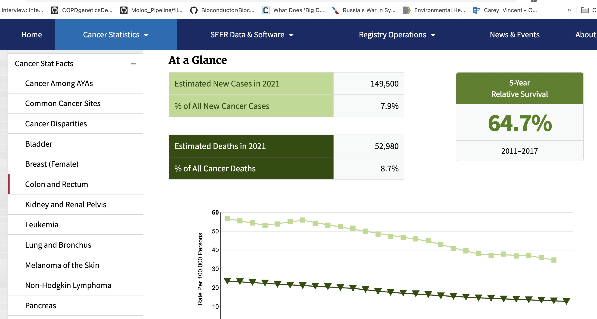

```{r setup,echo=FALSE,results="hide"}
suppressMessages({
 suppressPackageStartupMessages({
  library(YESCDS)
  library(DT)
  data(vjc_cancer_net)
  })
 })
```

# Cancer rates and public health

## Collecting cancer data

The role of statistics in our lives has
intensified with the COVID-19 pandemic.

Policymakers have proposed that personal protective
behaviors and legal obligations to mask
or avoid traveling can change depending on the
"infection rates" in localities.

Cancer Registries are systems managed at the
state level that collect information on cancers
as they are identified by health care providers.

"SEER" stands for Surveillance, Epidemiology and End Results.
It is a program developed at the National Institutes of Health (NIH)
National Cancer Institute (NCI).  Data are collected at 17 regional centers.

The SEER web site, offers various facets of cancer data to investigate.


## Body sites with relatively high cancer incidence


## New diagnoses, and deaths, over time

A very broad overview of cancer's impact on Americans over the past 20 years:


## Exercises

A.2.1 The display just above asserts that over 1.8 million Americans will
present with a new cancer diagnosis in 2021.  Re-express this prediction as
a "rate per 100,000 persons".

A.2.2 True or False: Of cancers newly identified in US citizens in 2021, more than 8\%
arise in the pancreas.

# A view of pancreatic cancer incidence

We can "drill down" on specific cancer types using the drop-down menu
at seer.cancer.gov.  For cancer of the pancreas we have:


# A view of colorectal cancer incidence

For cancer of the colon or rectum we have:



## Exercises

A.2.3  

