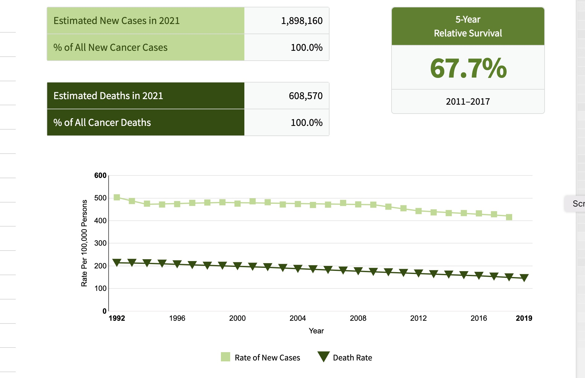

```{r setup}
suppressMessages({
 suppressPackageStartupMessages({
  library(YESCDS)
  library(DT)
  data(vjc_cancer_net)
  })
 })
```

# Cancer rates and public health

## Collecting cancer data

The role of statistics in our lives has
intensified with the COVID-19 pandemic.

Policymakers have proposed that personal protective
behaviors and legal obligations to mask
or avoid traveling can change depending on the
"infection rates" in localities.

Cancer Registries are systems managed at the
state level that collect information on cancers
as they are identified by health care providers.

"SEER" stands for Surveillance, Epidemiology and End Results.
It is a program developed at the National Institutes of Health (NIH)
National Cancer Institute (NCI).  Data are collected at 17 regional centers.

If we visit their web site, we can select facets of cancer data to investigate:


A very broad overview of cancer's impact on Americans is:



## Exercises
