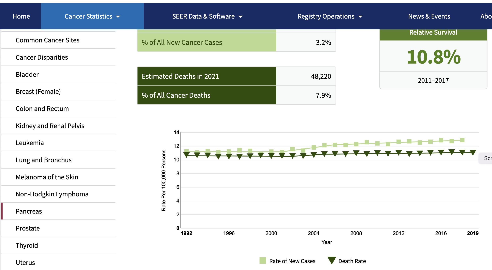

```{r setup,echo=FALSE,results="hide"}
suppressMessages({
 suppressPackageStartupMessages({
  library(YESCDS)
  library(DT)
  data(vjc_cancer_net)
  })
 })
```

# Cancer rates and public health

Motivations for studying cancer at the *population level* are detailed
on a [National Cancer Institute web page.](https://www.cancer.gov/research/areas/public-health)

Briefly, cancers contribute to

- years of life lost
- loss of quality of life for patients and families
- lost productivity

Furthermore, as the population ages, the effects of cancer will be more pronounced as time goes on.


*Although cancer affects individual patients and their families in different ways, studying 
its impact on large populations can provide important information that influences 
practices, policies, and programs that directly affect the health of millions of people in 
the United States each year.* -- from the NCI web page

This idea of "studying [cancer's] impact on large populations" brings us immediately to data
science and statistics.

Two terms of epidemiology will be of use to us

- *prevalence*: the proportion of the population currently affected by a disease
- *incidence*: the proportion of the population, in a given time interval, that
was disease-free prior to the interval but developed the disease within the interval

Prevalence expresses the current burden of disease within a population.

Incidence expresses the rapidity with which a disease grows in a population.

For a more detailed discussion of these terms, check [this CDC site](https://www.cdc.gov/csels/dsepd/ss1978/lesson3/section2.html#:~:text=Incidence%20refers%20to%20the%20occurrence,cases%20per%20unit%20of%20population.).

An excellent resource on rate estimation and interpretation is the [online book on
cancer screening](https://www.ncbi.nlm.nih.gov/books/NBK550212/pdf/Bookshelf_NBK550212.pdf) by Pamela Marcus, hosted at NCI.


## Collecting cancer data

The role of statistics in our lives has
intensified with the COVID-19 pandemic.

Policymakers have proposed that personal protective
behaviors and legal obligations to mask
or avoid traveling can change depending on the
"infection rates" in localities.

Cancer Registries are systems managed at the
state level that collect information on cancers
as they are identified by health care providers.

"SEER" stands for Surveillance, Epidemiology and End Results.
It is a program developed at the National Institutes of Health (NIH)
National Cancer Institute (NCI).  Data are collected at 17 regional centers.

The SEER web site, offers various facets of cancer data to investigate.


## Body sites with relatively high cancer incidence


## New diagnoses, and deaths, over time

A very broad overview of cancer's impact on Americans over the past 20 years:


## Exercises

A.2.1 The display just above asserts that over 1.8 million Americans will
present with a new cancer diagnosis in 2021.  Re-express this prediction as
a "rate per 100,000 persons".

A.2.2 True or False: Of cancers newly identified in US citizens in 2021, more than 8\%
arise in the pancreas.

# A view of pancreatic cancer incidence

We can "drill down" on specific cancer types using the drop-down menu
at seer.cancer.gov.  For cancer of the pancreas we have:



# A view of colorectal cancer incidence

For cancer of the colon or rectum we have:


## Exercises

A.2.3 Which of the following describes observations on pancreatic cancer between
1992 and 2019?  

-  the death rate per 100000 population increased by two,
-  the rate of new pancreatic cancers per 100000 population increased by two,
-  the rate of new pancreatic cancers per 100000 population remained stable.

A.2.4 True or false: The death rate, and the incidence rate, for cancers of colon
and rectum were approximately halved in the interval between 1992 and 2019.

