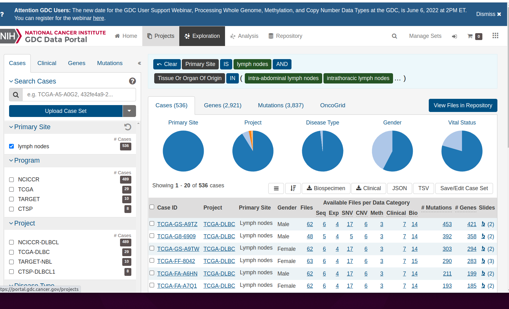
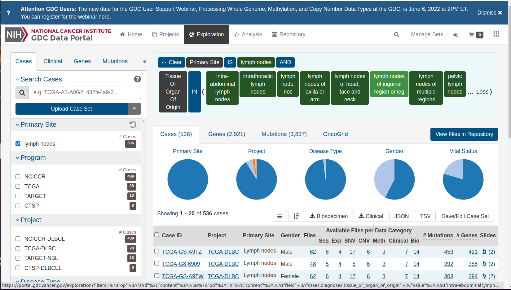
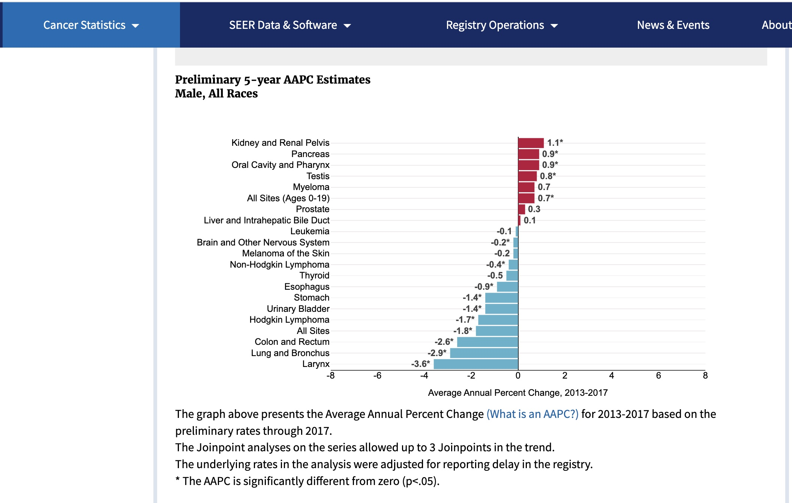

```{r setup,echo=FALSE,results="hide"}
suppressMessages({
 suppressPackageStartupMessages({
  library(YESCDS)
library(DT)
library(tibble)
library(dplyr)
library(plotly)
library(ggplot2)
library(ggbeeswarm)
library(DT)
data(woncan_meta)
data(woncan)
littab = woncan |> select(MSA, `Cancer Sites`, Age.Adjusted.Rate) |> as.data.frame()
  })
 })
```

# Cancers originate in specific organs


This display can be found at the NCI [Genomic Data Commons](https://portal.gdc.cancer.gov/).

## Resources for basic research

The Data Commons centralizes cancer data resources from a variety of
large-scale basic research projects.  It is not used to record population-level
information about ongoing cancer risks.

Click on the right shoulder of the female form to find



Notice the description of the logic of selecting the 'shoulder', which
contains an icon depicting lymph nodes.  There are tiles expressing
the logic of selecting information on lymph nodes from the
data commons.  "Primary Site" IS "lymph nodes" AND "Tissue or Organ
Of Origin" IN and then a parenthesis begins.  Click on the
ellipsis to reveal the full set of lymph-related tissues:



If we "clear" the selection, we get a complete overview of
all studies and cancer types.


#### Exercise

C.1.1 After clearing the selection, hover over the
"Disease Type" pie chart to learn the most common cancer types.

#### Answer

C.1.1

## Resources on the burden of cancer in the population, by primary site

The Genomic Data Commons gives an overview of resources for basic
research in cancer.  Epidemiologic research is conducted at
the population level, and includes efforts to identify all
reports of cancer diagnoses throughout the United States.

There is generally a time lag for collecting and processing data.
Estimates for 2018 and later years are still being developed.

### Summarizing annual changes in rates

In these displays, the focus is on changes in the population burden.
The Average Annual Percentage Change (AAPC) is a number we want
to be negative.  This would indicate that the risk of this
type of cancer is diminishing over time.

SEER (Surveillance, Epidemiology and End Results)
[estimates for 2017](https://seer.cancer.gov/statistics/preliminary-estimates/preliminary.html) for
males:



For females:


### Detailed visualization of the trends

We have a table distributed by the SEER program.

```{r lktab}
data(SEER_2018)
datatable(SEER_2018[,2:6])
```

This can be used to visualize trends over time.
```{r dopl1,echo=TRUE}
mkid = SEER_2018 |> dplyr::filter(CancerSite == "Kidney and Renal Pelvis" & Sex == "Male") 
fcol = SEER_2018 |> dplyr::filter(CancerSite == "Colon and Rectum" & Sex == "Female") 
with(mkid |> dplyr::filter(Race=="All Races"), plot(rate.2.2018~Year, ylab="Incidence per 100000", xlab="Year",
    main="SEER Kidney and Renal Pelvis, Male"))
with(fcol |> dplyr::filter(Race=="All Races"), plot(rate.2.2018~Year, ylab="Incidence per 100000", xlab="Year",
    main="SEER Colon and Rectum, Female"))
```

The plot for Kidney and Renal Pelvis cancer for males shows a difficulty
with summarizing rates by a single number (e.g., average annual percentage change).
The rates can change in complex ways owing to

- changes in approaches to screening
- logistical problems of reporting
- improvements in preventive strategies

Epidemiologists try to uncover causes of changes in rates, and produce methods to
reliably summarize them in the face of these complications.

<!--
dim(mkid)
with(mkid |> dplyr::filter(Race=="All Races" & Year >= 2013), lm(rate.2.2018~Year))
with(mkid |> dplyr::filter(Race=="All Races" & Year >= 2013), plot(rate.2.2018~Year))
6/17
17+.35*17
with(mkid |> dplyr::filter(Race=="All Races"), plot(rate.2.2018~I(Year-2000)))
with(mkid |> dplyr::filter(Race=="All Races"), lm(rate.2.2018~I(Year-2000)))
.34/17
with(mpanc |> dplyr::filter(Race=="All Races"), lm(rate.2.2018~I(Year-2000)))
.125/12.89
head(mkid)
head(mpanc)
SEER_2018 |> dplyr::filter(CancerSite == "Leukemia" & Sex == "Male")  -> mleuk
head(mleuk)
SEER_2018 |> dplyr::filter(CancerSite == "Lung and Bronchus" & Sex == "Male")  -> mlung
head(mlung)
with(mlung |> dplyr::filter(Race=="All Races"), lm(rate.2.2018~I(Year-2000)))
with(mlung |> dplyr::filter(Race=="All Races"), plot(rate.2.2018~I(Year-2000)))
-1.8.88.7
-1.8/88.7
with(mlung |> dplyr::filter(Race=="All Races" & Year >=2013), plot(rate.2.2018~I(Year-2000)))
with(mlung |> dplyr::filter(Race=="All Races" & Year >=2013), lm(rate.2.2018~I(Year-2000)))
-2.06/91.5
-->


## Cancer subtype hierarchy

The lists of cancer sites we've seen thus far are
fairly informal.  Cancer subtypes can be identified by
various methods, with implications for prognosis and treatment.

The oncotree resource at Memorial Sloan-Kettering presents a snapshot
of current thinking about relationships among cancer types.

Below is a small excerpt from the [oncotree](http://oncotree.mskcc.org/#/home), showing a subset
of subtypes of brain cancer types.  Many of the nodes on the right
can be expanded to reveal additional subtypes.


