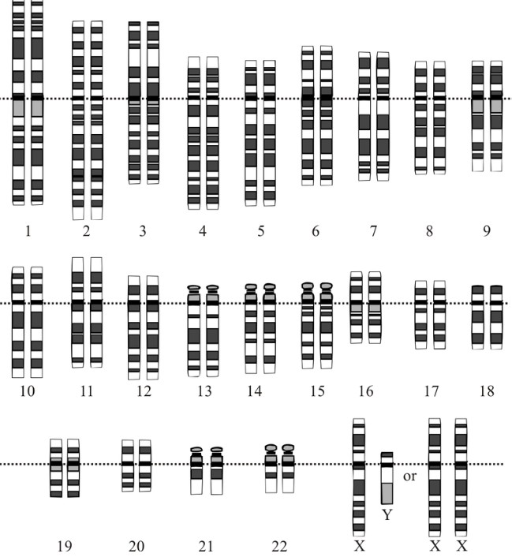

```{r setup,echo=FALSE,results="hide"}
suppressMessages({
 suppressPackageStartupMessages({
  library(YESCDS)
library(tibble)
library(dplyr)
library(plotly)
library(ggplot2)
library(ggbeeswarm)
library(DT)
data(woncan_meta)
data(woncan)
littab = woncan |> select(MSA, `Cancer Sites`, Age.Adjusted.Rate) |> as.data.frame()
  })
 })
```

# Molecular origins of tumors and their spread

In this segment we will review basic definitions underlying
the use of data to understand variation in genetic processes connnected
with initiation and progression of cancer.

## Human genome

The human genome is composed of 22 autosomal chromosome pairs
and 1 pair of sex chromosomes.  Autosomal chromosomes are numbered 1-22;
females have a pair of X chromosomes, and males have a pair labeled X and Y.



## Central dogma

"DNA makes RNA makes protein"

The genetic material from which chromosomes are formed is DNA (deoxyribonucleic acid).

DNA is transcribed to RNA (ribonucleic acid)

RNA is translated to protein.

A schematic from [Wikipedia](https://en.wikipedia.org/wiki/Central_dogma_of_molecular_biology#/media/File:Cdmb.svg), by Adenosine


## Gene counts by chromosome

"Gene" refers to a physical and functional component of the genome that
is inherited between generations.

Gene finding and gene counting are basic tasks of bioinformatic analysis.

The sizes of chromosomes and numbers of genes currently known are depicted here:


## Browsing the reference genome

Visit [the genome browser for the gene called TTN](https://genome.ucsc.edu/cgi-bin/hgTracks?db=hg19&lastVirtModeType=default&lastVirtModeExtraState=&virtModeType=default&virtMode=0&nonVirtPosition=&position=chr2%3A179250000%2D179812868&hgsid=1377911977_sxQEMUOHBeopzad7Oql0bsSeaceA) and you will see something like


The display includes a karyogram (depiction of the entire chromosome) with a red
patch indicating the portion of the chromosome being viewed.  You can zoom out or
in using the controls.  

Each of the bands labeled TTN depicts a transcript of that gene.  Distinct transcripts
are formed as transcriptional machinery splices out different subsequences that we
call introns.  The transcript is a series of stitched-together exons.

### Exercises

- Use the UCSC genome browser to visualize the entirety of chromosome 17 in
reference build "hg19".  What is the length of the chromosome in base pairs?

- Browse to the gene BRCA2.  What is its length in base pairs?

## Copy number alterations

Changes to chromosome structure are often found in tumor DNA when compared
to normal tissue DNA.  An example is region duplication:


Deletions and translocations (parts of chromosomes
are exchanged) are other important genomic alterations
in cancer.

# Views of genomic variation in breast cancer

## A [2012 view](http://www.ncbi.nlm.nih.gov/pubmed/22522925) of the whole genome

In this display, the chromosomes are ordered across the screen, from 1 to 22 followed by X.

Because this display concerns breast cancer in females, no Y chromosome is depicted.

The display is focused on "copy number alterations" (CNAs) in tumors -- where (possibly large)
segments of chromosomal
DNA have been duplicated or deleted in the tumor.  Red spikes denote positions where
duplicating CNAs are associated with expression changes of nearby genes, blue spikes
where a deleting CNA affects expression.


The figure above is drawn from a paper studying 2000 breast tumors.  A more recent [survey](https://www.frontiersin.org/articles/10.3389/fonc.2021.700568/full)
shows that the phenomenon pervades a broad spectrum of cancer types studied in The Cancer
Genome Atlas (TCGA).


## TCGA: common mutations; TTN mutation and survival

This display is from the NCI Genomic Data Commons:
 


While the "titin" gene (TTN) is frequently mutated in TCGA breast cancer samples,
and there is some indication that TTN mutations are disadvantageous for survival,
the mechanism by which TTN may affect tumor progression is not understood.

The mutations seen in TTN may be "passenger" mutations with no functional significance.

The mutation "spectrum" is sometimes depicted using the oncogrid display.


Each column is a single tumor; each row a gene in which mutations
were found for at least one of the patients.
The overall interpretation is that there is striking diversity in
the collection of mutated genes found for each patient.

### Exercises

- Use the Genomic Data Commons data portal to explore data
on prostate cancer in the TCGA project.  What are the five
genes reported to present the largest number of mutations
across patients in that project?

- Repeat the exercise for ovarian cancer in TCGA.

- Use the "Survival" widget at the Genomic Data Commons to compare
the survival times for ovarian cancer patients
with and without mutation in CSMD3.  Is CSMD3 mutation associated
with longer or shorter median survival time?  About how
large is the difference?

## Clustering mRNA profiles of genes and tumors to find subtypes: [van 't Veer et al. 2002](https://www.nature.com/articles/415530a.pdf?origin=ppub)

The following display summarizes about 500000 numbers (5000 genes by 98 tumors).  Red
patches are plotted for genes that are up-regulated (compared to adjacent normal tissue)
in the associated tumor.  Cluster trees are included to show the existence of groups
genes that have similar expression across tumors, and groups of tumors that show
similar expression across genes.


# Evolution of tumor genome within a patient with metastatic breast cancer

Most of what we have covered so far pertains to molecular aspects
of tissue taken from primary tumor samples.  

After time, and especially after treatment has begun, tumor genomes
can adapt to avoid treatment effects and resume division.

A [2021 paper from the Gabor Marth lab](https://genomemedicine.biomedcentral.com/track/pdf/10.1186/s13073-021-00989-6.pdf)
details the experience of one patient.


Using a rapid autopsy and genetic sequencing of tumors that metastasized to multiple organs,
Huang and colleagues map the clonal diversification of the primary tumor genome into
tumors that emerged in different organs.


One of the elements with which this map of progressive metastasis was constructed
is an analysis of copy number aberrations (CNAs).  An interactive view of
these CNAs in sampes from the 28 tumors in different body site is 
<a href="cnv-heatmap.html">here</a>.
