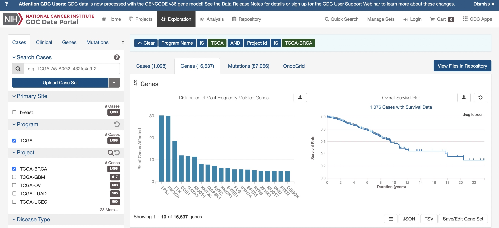

```{r setup,echo=FALSE,results="hide"}
suppressMessages({
 suppressPackageStartupMessages({
  library(YESCDS)
library(tibble)
library(dplyr)
library(plotly)
library(ggplot2)
library(ggbeeswarm)
library(DT)
data(woncan_meta)
data(woncan)
littab = woncan |> select(MSA, `Cancer Sites`, Age.Adjusted.Rate) |> as.data.frame()
  })
 })
```

# Cancers locate in specific organs


## The burden of cancer by primary site

SEER (Surveillance, Epidemiology and End Results)
[estimates for 2017](https://seer.cancer.gov/statistics/preliminary-estimates/preliminary.html) for
males:


For females:


## Survival curves: typical and extreme fates for those with cancer

## Genes that are often mutated in cancer

# A view of breast cancer survival

## An overall survival curve



## Curves comparing persons with and without mutation
