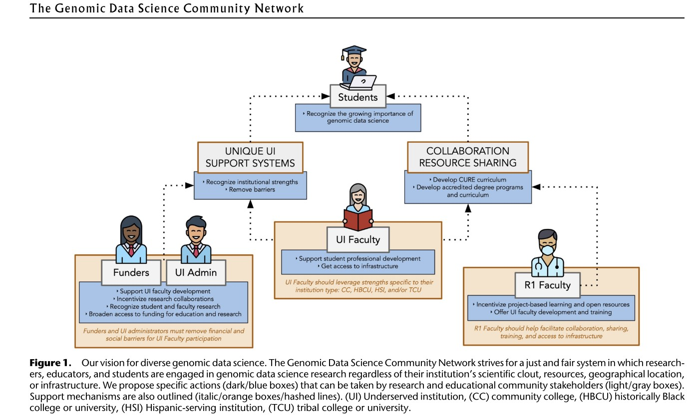
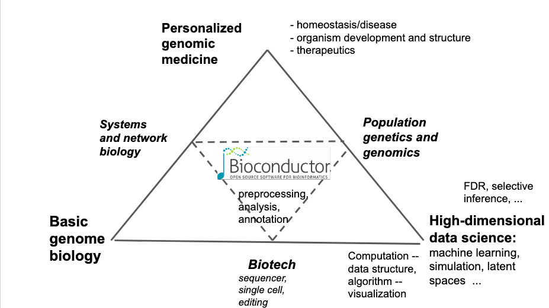
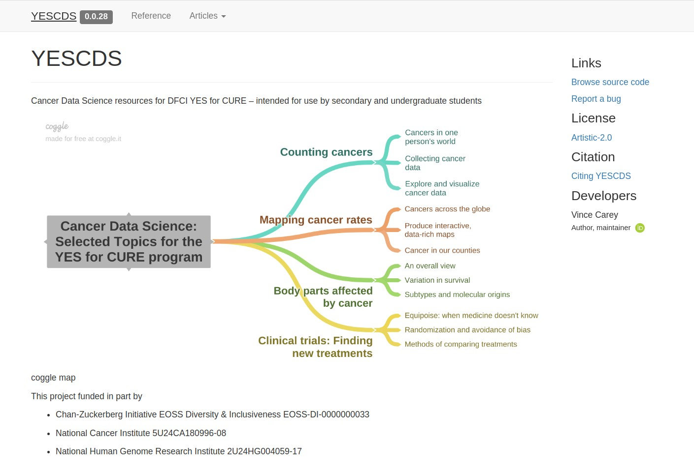
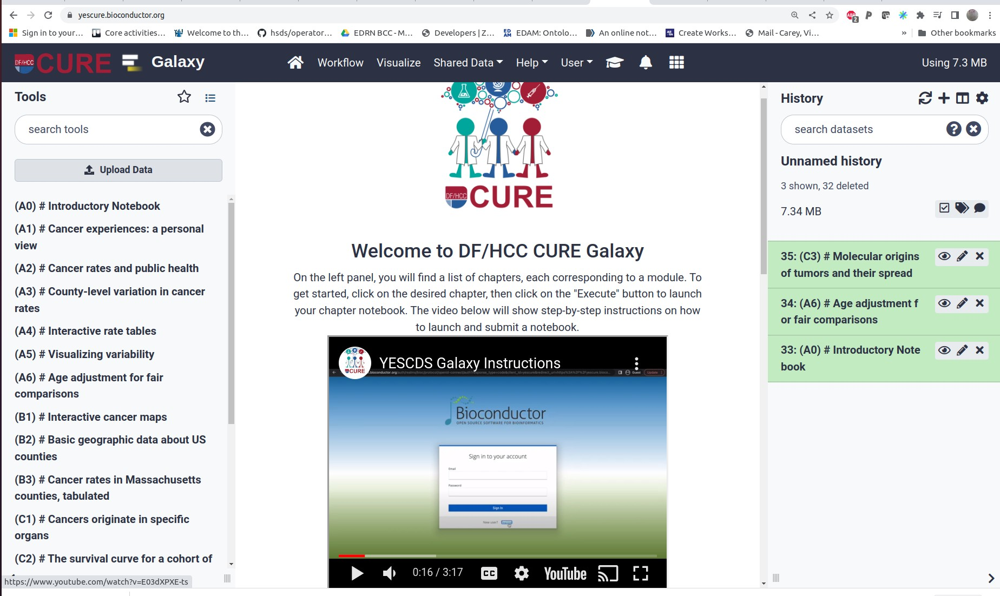

```{r setup,echo=FALSE,results="hide"}
suppressMessages({
 suppressPackageStartupMessages({
  library(YESCDS)
library(tibble)
library(dplyr)
library(plotly)
library(ggplot2)
library(ggbeeswarm)
library(survival)
library(DT)
  })
 })
```

# Introduction: Grow the genomics data science workforce



# Bioconductor as a vehicle



# R packages and r markdown as instructional assets



# Galaxy deployed in NSF Jetstream2 as the presentation/experience platform


